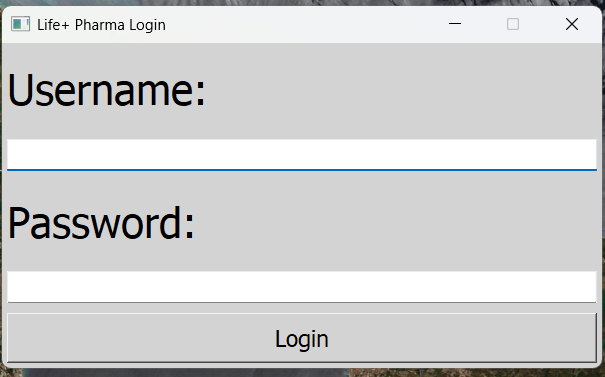
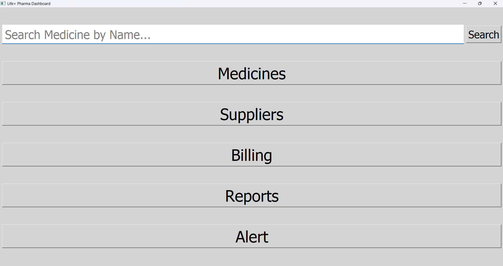
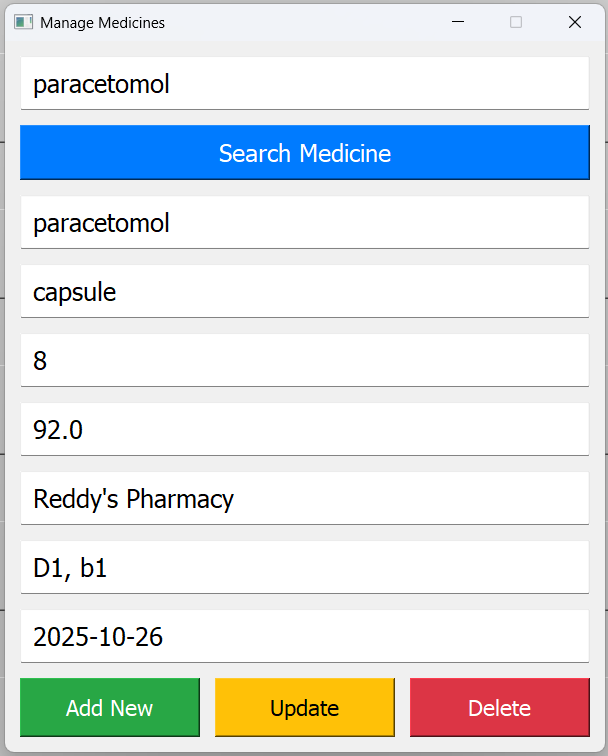
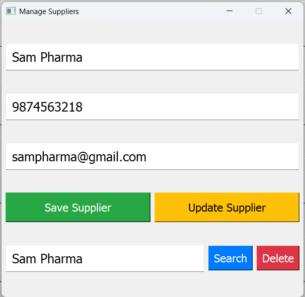
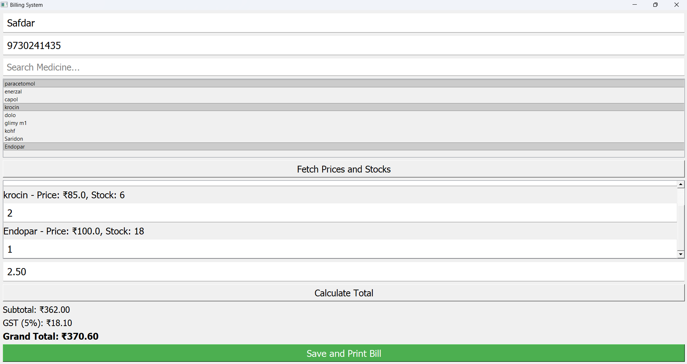
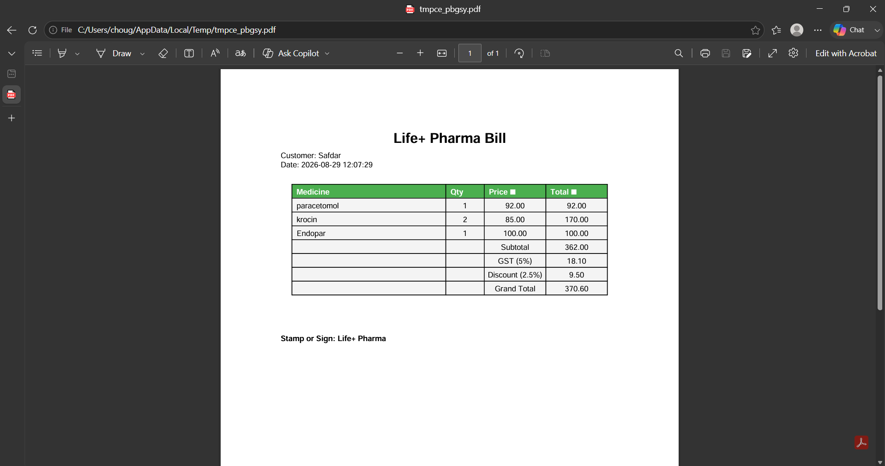
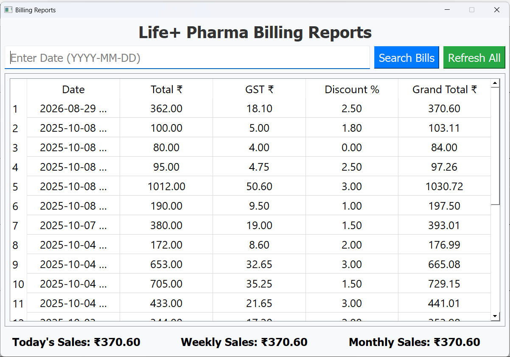
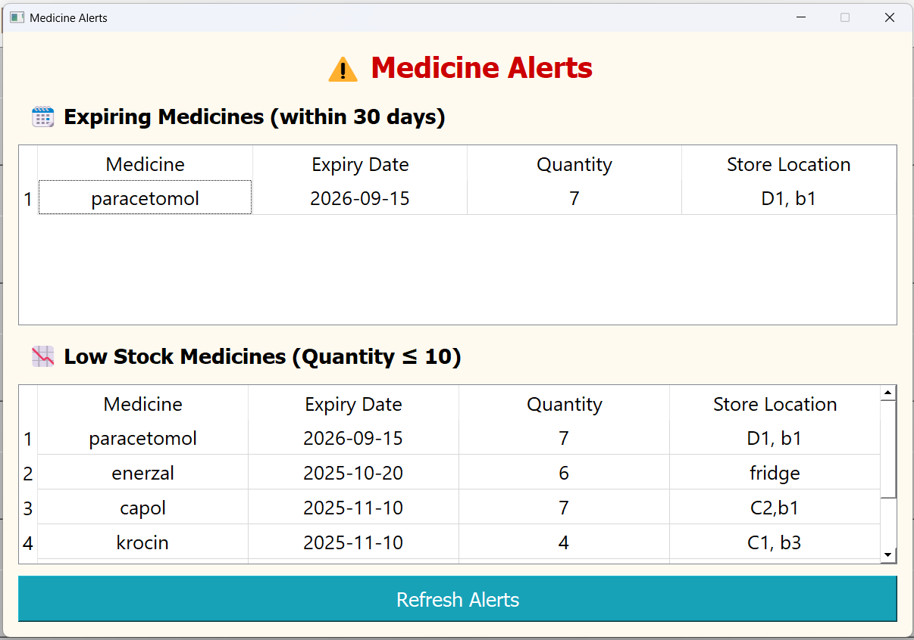

# Pharmacy Management System

A desktop application for handling day-to-day pharmacy operations — medicine inventory, suppliers, billing, stock alerts, and sales reports — from a single interface instead of scattered manual records.

## Features

- Admin login and access control
- Add, update, delete, and search medicines
- Track medicine stock and expiry dates
- Manage supplier information
- Create and manage customer bills
- Automatic GST and discount calculations
- Bill printing
- Low-stock alerts
- Medicine expiry alerts
- Daily, weekly, and monthly sales reports
- SQLite database for storing application data

## Tech Stack

- **Python**
- **PyQt5** — Desktop GUI
- **SQLite** — Database
- **Visual Studio** — Development environment

## Application Modules

### Login
Handles authentication for authorized access to the application.

### Dashboard
Main landing area after login, giving access to all other modules.

### Medicine Management
Add, update, delete, and search medicines, including stock and expiry tracking.

### Supplier Management
Manage and search supplier records.

### Billing
Handles medicine selection, quantity, GST, discounts, total calculation, and bill generation.

### Alerts
Shows low-stock medicines and medicines nearing expiry.

### Reports
Sales reports across daily, weekly, and monthly periods.

## Project Structure

```text
PharmacyApp/
│
├── add_medicine.py
├── alert.py
├── billing.py
├── dashboard.py
├── db.py
├── delete.py
├── login.py
├── main.py
├── manage_suppliers.py
├── reports.py
│
├── PharmacyApp.pyproj
├── PharmacyApp.sln
├── .gitignore
└── README.md
```

## Getting Started

### Prerequisites

- Python 3.x
- pip

### Installation

Clone the repository:

```bash
git clone https://github.com/YOUR_USERNAME/PharmacyApp.git
```

Move into the project directory:

```bash
cd PharmacyApp
```

Install PyQt5:

```bash
pip install PyQt5
```

### Run the Application

```bash
python main.py
```

## Database

The application uses SQLite for local data storage. The database file is excluded from the repository via `.gitignore`, keeping the local database separate from the source code so each installation maintains its own data.

## Screenshots

Add screenshots of the application here.

```markdown








```

## What I Built

This project is a desktop-based solution for managing the core operations of a pharmacy — inventory, suppliers, billing, alerts, and reporting — brought together into one application, with a focus on keeping the workflow simple.

## Future Improvements

- Role-based permissions for different staff members
- Automated database backups
- Cloud-based data synchronization
- Multi-branch pharmacy support
- Improved analytics and dashboards
- More detailed inventory history
- Online deployment or web-based version

## Author

**Safdar Chougle**
Full-Stack Developer

## License

This project is available for educational and portfolio purposes.